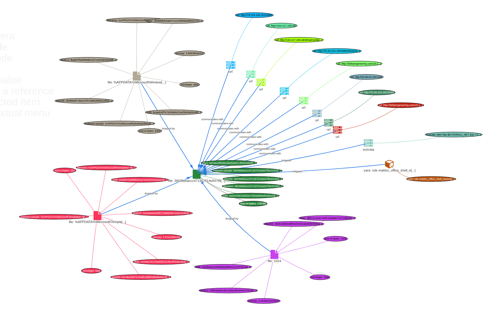
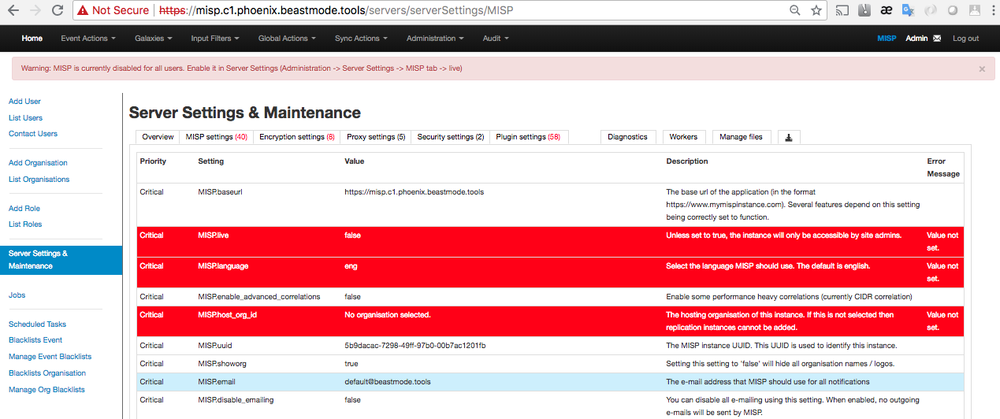
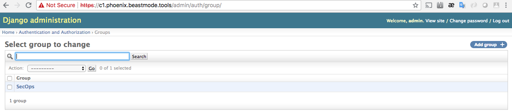

# Phoenix Malware Analysis Appliance
##### We are eager to work with any colleges and universities to help implement Phoenix into their curriculum, especially as it pertains to creating and testing countermeasures.
##### If Phoenix helps you win and save money, consider donating to our gear & beer fund: 3N8fx47jEKQ6WUUXeziPrS7d1SpWbj954g

---
#### Start generating, and sharing, your own Threat Data and Controls today!



##### Want to know if your production IPS and Yara rules will help mitigate that nasty Word doc going around?  Just submit it to Phoenix and know if you have coverage, or if you need to create a  countermeasure.


##### See an interesting report online with a list of hashes?  Have a ReversingLabs API key, or a VT key?  Want to see how your controls would measure up?  Paste your key and your hash list into Phoenix and start detonating malware en masse.


##### Have multiple teams working multiple incidents?  Phoenix was built with trust groups and basic TLP as its foundation for authorization.
###### TLP Green - Anyone with a valid Phoenix account can view or hunt against the data
###### TLP Amber - Only members of your groups can view or hunt using the data
###### TLP Red - Only you can view or hunt against the data

### Preparing OpenVPN configs
If you have a folder of OpenVPN configs that end in `.ovpn`, then run this to modify them slightly:
```bash
    cd my/openvpn/directory
    ls *ovpn|while read line; do O=$(echo $line|sed 's/ //g'); mv "$line" "$O"; do
ne

ls *ovpn|while read vpn; do echo 'route 0.0.0.0 192.0.0.0 net_gateway
route 64.0.0.0 192.0.0.0 net_gateway
route 128.0.0.0 192.0.0.0 net_gateway
route 192.0.0.0 192.0.0.0 net_gateway' >> $vpn; done

ls *ovpn|awk -F '.' '{print $1}'|while read line; do mv $line.ovpn $line.conf; done


```

### Preparing VMs for Phoenix

##### Ensure you set your $HOSTNAME properly first, as we generate many things which are dependent on this

If you already run Cuckoo on machinery other than VirtualBox then you can ignore the next instructions and just copy and paste your current configs once the easy-button has finished.  
Those of you already running Cuckoo deployments on VirtualBox have an easy migration path.  Tar up your VirtualBox machine directories and import them as a tarball with the easy-button.  
Doing this will preserve your snapshots, so you shouldn't need much (if any) configuration to migrate from your existing Cuckoo deployment to Phoenix.
To export your VMs in a way that the easy-button knows how to import, su to your VirtualBox user, run the following commands, and put the output .tar.gz file in ./install/virtualbox/:
```bash
	VBOXDIR=$(vboxmanage list systemproperties|grep "Default machine folder:"|awk -F 'Default machine folder:' '{print $2}'|sed -e 's/^          //g')
	cd "$VBOXDIR/../"
	tar -cpzf "$HOME/$(echo $VBOXDIR|awk -F '/' '{print $NF}'|sed 's/ //g').tar.gz" "$(echo $VBOXDIR|awk -F '/' '{print $NF}')"
```
### Installing the Phoenix appliance
##### Consider the easy-button a 'quickstart' guide, as there are dozens of ways to deploy and configure Cuckoo/Phoenix.
##### A typical build with the VM installation and all configuration takes around an hour, but once you start the easy-button there is no interaction, so be sure your variables are correct in `./install/ubuntu_install.sh` before running it.
##### The easy-button was designed to perform the following on a baremetal, clean install of Ubuntu 16.04

* update_packages
* setup_rsyslog
* tune_mongo
* install_docker
* configure_es
* import_kibana
* setup_iptables
* import_grafana
* setup_virtualbox
* setup_rclocal
* add_cuckoo_user
* setup_fail2ban
* setup_certificates
* setup_apache2
* setup_cuckoo_daemons
* setup_moloch
* install_vms
* setup_crontab
* setup_openvpn
* configure_cuckoo
* setup_tcpdump
* configure_hunt_containers
* setup_netdata


### Building Phoenix
##### In our environment, we use a larger spinning RAID 5 mount (/data) and an SSD mount (/ssd).  Keep this in mind when setting up the installer script.
### *Make sure you change the variables (like usernames and passwords) in ubuntu_installer.sh before you build.*
##### Our automated Phoenix build script looks like this:

```bash
	#!/bin/bash
	CUCKOO_USER="cuckoo"
	echo "Cloning phoenix"
	if [ -z "$(which git)" ]; then
	    apt-get -y install git
	fi
	if [ -z "$(which add-apt-repository)" ]; then
	    apt-get -y install software-properties-common
	fi
	git clone https://github.com/SparkITSolutions/cuckoo.git /opt/phoenix
	## We used to import ova files, but then you have to setup snapshots.  We're lazy... 
	## You can still have the easy-button import your OVAs, but then you'll have to do stuff like this later to setup snapshots:
	##
	## su - cuckoo
	## vboxmanage modifyvm win7-x86-0 --vrde on
	## vboxmanage modifyvm win7-x86-0 --vrdeaddress 127.0.0.1
	## vboxmanage modifyvm win7-x86-0 --vrdeport 3389
	## vboxheadless -v on -e authType=NULL -s $$VMNAME
	##
	#cp /data/staging/vms/*.ova /opt/phoenix/install/virtualbox/
	echo "Copying staging VMs"
	cp /data/staging/VirtualBoxVMs.gz /opt/phoenix/install/virtualbox/
	echo "Copying openvpn files"
	cp /data/staging/openvpn/* /opt/phoenix/install/openvpn/
	cd /opt/phoenix/install
	echo "Installing phoenix"
	## This is where the magic happens...
	bash ubuntu_install.sh
	## Copy the virtualbox config from your existing Cuckoo deployment into Phoenix
	cp /data/staging/virtualbox.conf /opt/phoenix/conf/
	chown $CUCKOO_USER.$CUCKOO_USER /opt/phoenix/conf/*
	## Restart all of your newly installed Cuckoo services
	/opt/phoenix/utils/crontab/root/cuckoo_full_restart.sh
	## Go get your miscreant punch on!!!
```

#### By installing using the easy-button, you receive the following services, which you'll need to setup dns/hosts file entries for:
* https://$PHOENIX_HOSTNAME - Django Phoenix interface
* https://netdata.$PHOENIX_HOSTNAME - Netdata performance monitoring


* https://grafana.$PHOENIX_HOSTNAME - Mongodb and Elasticsearch health and performance dashboards


* https://kibana.$PHOENIX_HOSTNAME - Kibana dashboards and logging with the following indexed logs: linux-*, iptables-*, docker-*, cuckoo-*, apache2-*, fail2ban-*, mongo_stats-*, sessions-*


* https://moloch.$PHOENIX_HOSTNAME - Local Moloch instance


* https://misp.$PHOENIX_HOSTNAME - Local MISP instance


### Post easy-button configuration

##### Login to https://misp.$PHOENIX_HOSTNAME and change the default username/password (admin@admin.test/admin).  


##### Click on `Admin` in the top right corner.  The API key will need to be copied from here and added to `/opt/phoenix/conf/reporting.conf` under the `[z_misp]` heading.


##### Click on `Global Actions` -> `List Object Templates`, then select `Update Objects`


##### Click on `Administration` -> `Server Settings & Maintenance`, then click on `MISP Settings`.  The only actual option that needs to be change is `live`, but we recommend going through all of the red and yellow MISP values and setting them appropriately.




##### In order to do any reasonable amount of samples, we'll want to disable the MISP correlation.  This 'feature' renders MISP largely useless if left enabled.  Set `MISP.completely_disable_correlation` to `true`.


###### *Double click MISP option values to set.*

##### Once you've finished setting up MISP, we need to do a full cuckoo restart

```
    /opt/phoenix/utils/crontab/root/cuckoo_full_restart.sh
```

##### Now that MISP is configured, navigate to https://$PHOENIX_HOSTNAME/admin as the admin user and setup some groups.  Let's start with `SecOps` and `CyberIntel`. For any and all groups you create within Phoenix's Django interface, leave all of the permissions the way they are (empty).





##### Now that we have trust groups setup in Django, we need to add the same (case sensitive) groups within MISP.  Within your MISP instance go to `Global Actions` -> `Add Sharing Group` and add `SecOps` and `CyberIntel`.


##### With the Django groups and the MISP sharing groups now in sync, we can start adding users to groups.

```
python /opt/phoenix/utils/setup_user.py -h 2>/dev/null
usage: setup_user.py [-h] [-e EMAIL] [-g GROUPS]

Phoenix user add script

optional arguments:
  -h, --help            show this help message and exit
  -e EMAIL, --email EMAIL
                        Email to add
  -g GROUPS, --groups GROUPS
                        Groups to add the email to - comma separated
```
```
python /opt/phoenix/utils/setup_user.py -e JoeBlow@yourdomain.com -g "SecOps,CyberIntel"
```
##### With users and groups setup, you can start submitting files, and enjoying your Phoenix install
##### To programmatically submit files from [Reversing Labs](https://www.reversinglabs.com) or [Virus Total](https://virustotal.com) take a look at `/opt/phoenix/utils/auto_submit.py`

### Pro Tips:
* We haven't seen any issues using chrome, so I'd advise using that browser with Cuckoo/Phoenix
* There are some additional configurations you can enable to make cuckoo use other (larger/faster) mounts if you have those on your systems.  Read through the comments in ubuntu_installer.sh
* To update the code from github, simply run update_cuckoo.sh from the root of your cuckoo folder (in our example /opt/phoenix).  
*** We recommend you backup before you run this ***
* Put the Yara rules you'd like tagged into MISP in /opt/phoenix/data/external
* When using the auto-tagging feature (conf/misp.json) make sure to setup your tags within MISP first, and use the ID which MISP generates there for your auto-tagging
* Cuckoo has bugs.  We did everything we could to package up great logging with this appliance.  If things crash, please take a look in kibana and the logs there.
* We've seen sometimes where cuckoo.py crashes, so often we'll run it in a screen like so:

```
screen -R cuckoo
su - $CUCKOO_USER
cd /opt/phoenix
python cuckoo.py -d -m 1000000
```

* If you want to greatly improve processing time, especially as it pertains to volatility, look at conf/memory.conf and allocate some space to `memdump_tmp`.  That will ensure that all volatility processing (very heavy IO) is done entirely in memory.
* Got lots of cores?  Modify /etc/init.d/cuckoop and crank the threads up for processing.  Use netdata to figure out what your bottlenecks are (disk, cpu, etc.) and tune accordingly.

If you use this greasy hack, remember to take `cuckood` out of `PROGNAMES` in `/etc/init.d/cuckoo_all`.


Take a look at Phoenix in our presentation at ACoD in Austin.

[Phoenix Presentation](https://docs.google.com/presentation/d/1Esvck465UX2REGijGnZtS6_GugstS5NIJC2uvO2g0C0/edit?usp=sharing)

###### We would like to see these changes forked back to the main branch and will be working with the Cuckoo developers to merge our changes


In three words, [Cuckoo Sandbox](http://www.cuckoosandbox.org) is a malware analysis system.

What does that mean? It simply means that you can throw any suspicious file at it and in a matter of seconds Cuckoo will provide you back some detailed results outlining what such file did when executed inside an isolated environment.

If you want to contribute to development, please read [this](http://www.cuckoosandbox.org/development.html) and [this](http://www.cuckoofoundation.org/contribute.html) first. Make sure you check our Issues and Pull Requests and that you join our IRC channel.

